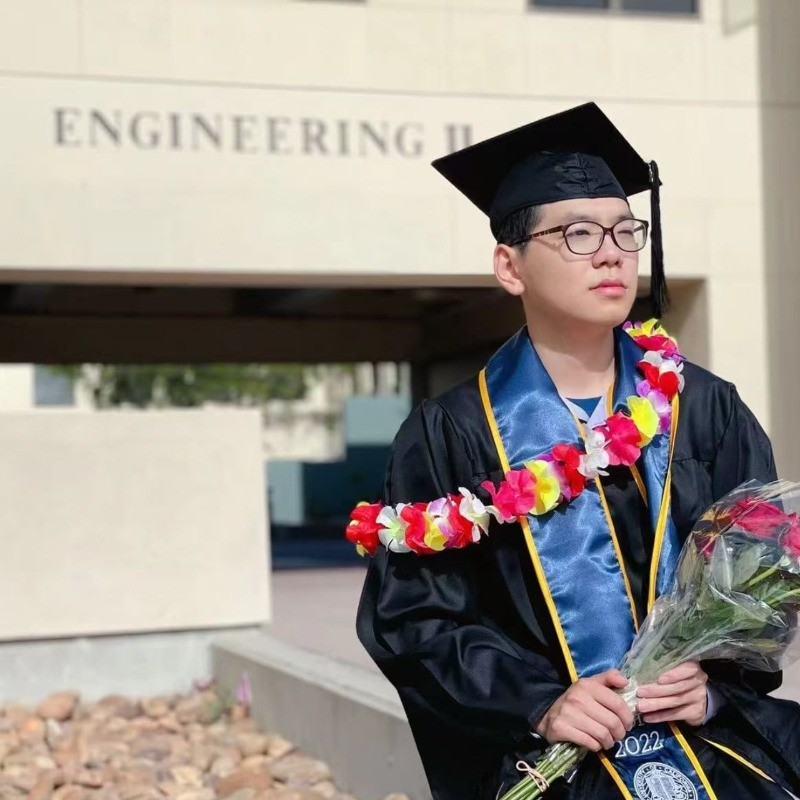

# Jayden Yu - Portfolio  
   

## Introduction  
Hello! I’m **Jayden Yu**, I build AI Saas products          

## Products:
### [wellbeingABC.com](https://wellbeingABC.com)
- Built a comprehensive mental health and peer-support platform featuring dual-language support, dynamic service directories, and peer-to-peer support requests aimed at connecting users with qualified coaching professionals. 
- Designed robust transaction and communication pipelines, utilizing Supabase for real-time chat, Row Level Security (RLS) for data privacy, and a seamless international payment integration system for frictionless checkout and revenue tracking. 

### [tomatomeet.com](https://tomatomeet.com)
- Engineered a real-time AI meeting assistant using Next.js 14 and Node.js, architecting a scalable video conferencing system with WebRTC (mediasoup SFU) and Socket.io to support low-latency, multi-participant audio/video streaming and instant state synchronization. 
- Designed an automated live-transcription and insights pipeline that streams continuous audio to OpenAI Whisper, utilizing GPT for real-time context analysis to dynamically detect Q&A, extract action items, and distribute comprehensive meeting summaries.

### [iNurra](https://devpost.com/software/inura/)
- Built a production-ready mobile application with React Native and Supabase, implementing secure data storage, real-time updates, and an intuitive UI tailored for accessibility by non-technical elderly users. 
- Designed a computer vision and natural language processing flow using Google Gemini capable of parsing messy, real-world photos into structured, actionable health data for automated care team alerts.

**Connect with me:**  
**Email:** jiaweiyu2009@gmail.com\
**LinkedIn:** [Linkedin](https://www.linkedin.com/in/jaydenyu0210)
