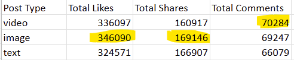
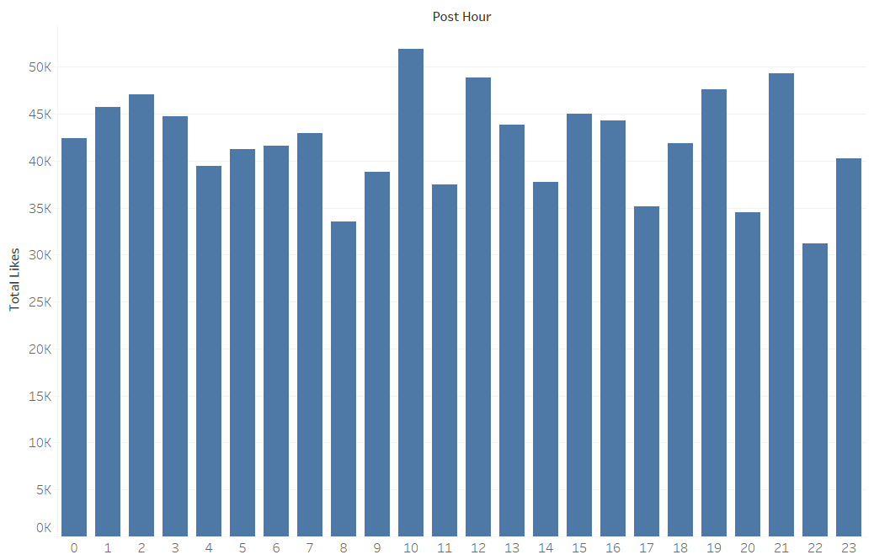

# Social Media Engagement

I pretend myself as the social media manager of a product or service. I would like to analyze on user engagement patterns in social media, so that it can help improve the social media advertisement effect.

Below are some questions that I came up with:

- Which social media platform (Facebook, Instagram, Twitter, LinkedIn, TikTok, etc.) generates the highest engagement (likes, shares, comments) for my content?

- What type of content (videos, images, text posts, polls, stories) drives the most engagement on each platform?

- When is the best time to post on each platform to maximize likes, shares, and comments?

- Do users engage more with promotional content, educational content, or entertaining content?

- What characteristics (hashtags, post length, emotions, call-to-action) make a post more likely to be shared?

- How does engagement differ between platforms (e.g., Instagram vs. LinkedIn) for the same type of content?

Then I was able to find this dataset on Kaggle that relates to social media user engagement. 
https://www.kaggle.com/datasets/abdullah0a/social-media-sentiment-analysis-dataset

This dataset is able to help me answer a few of the questions above.

1. What type of content (videos, images, text posts, polls, stories) drives the most engagement on each platform?

**SQL query:**\
SELECT `Post Type`, SUM(`Number of Likes`) AS `Total Likes`, SUM(`Number of Shares`) AS `Total Shares`, SUM(`Number of Comments`) AS `Total Comments` FROM synthetic_social_media_data
GROUP BY `Post Type`;

**Result:**\
\
Image posts will yield the most likes and shares, and video posts will yield the most comments.

**Action:**\
As a social media manager, I will avoid posting text only posts and try to post more images and videos to increase likes, shares, and comments.

2. When is the best time to post on each platform to maximize likes?
**SQL query:**\
SELECT PostHour, SUM(`Number of Likes`) AS TotalLikes
FROM (
	SELECT
		DATE_FORMAT(`Post Date and Time`, '%H') AS PostHour, `Number of Likes`
	FROM synthetic_social_media_data
) AS SUBQUERY
GROUP BY PostHour
ORDER BY PostHour;

**Visulization:**\

From the bar graph, the hours that have relatively high number of likes are 10am, 12pm, 7pm, and 9pm. The hors that have relatively low number of likes are 8am, 10pm, 5pm, and 8pm

**Action:**\
As a social media manager, I will create social media post on the peak hours and aovid doing it on the low hours.
